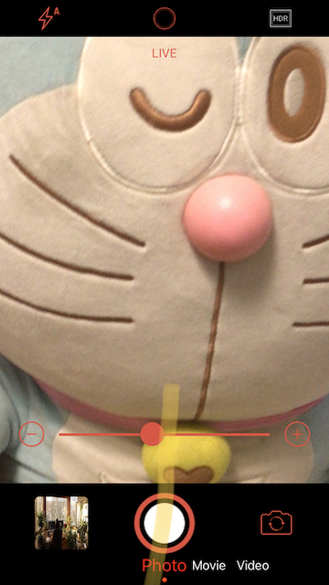

# AVFoundation
> projects demo code of learning ios avfoundation.  AVFoundation is Apple platforms advance objective-c/swift framework working with time base audio/video meida. It provide powerful wide range of facilities for capturing,
>  playback, editting, compositing audio/video.
> 

## AVPlayer Video player

### Features
- Video Play/Pause/Scrubing
- Full Screen Mode
- Title Options Selection
- Chapter Information Showing And Jumping

## AVCaptureSession Camera

### Features
- Photo/Video/Live Photo Capturing/Recordig
- Tap To Auto Focuse/Exposure
- Auto Stablizetion
- Front/Back Camera Zooming
-  Flash/Torch Setting
-  Real Time Image Filtering

